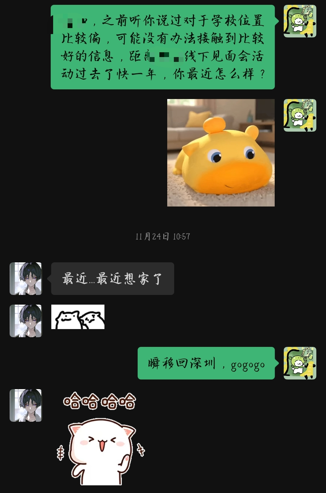

                                                  实习成果总结|2025年12月05日

目录
一．前言：从“初生牛犊”到“职业化”的蜕变
二.外功修炼：用结果说话的硬核战绩 
1. 邀约战绩：25%转化率背后的效率之战 
2. 技能重构：顾问式销售与用户分层策略
3. 极限挑战：广州48小时的多线程执行力
三． 内功心法：思维层面的三次核心觉察 
1. 拒绝“模糊”，拥抱“具体化” 
2. 打破“自我沉浸”，建立“对象感” 
3. 保持“空杯心态”，时刻倒空自己
四.结语：年少有为，有何不可？

五．附件：
1.针对不同用户的沟通方式截图
2.实习成果维度梳理表

                                             内外兼修—从业绩突围到思维重构的实习成长之路
一、 前言：从“初生牛犊”到“职业化”的蜕变
回想起实习伊始，我凭借着一股“初生牛犊不怕虎”的劲头，勇敢争取到了这次机会 。那时的目标很单纯：积累作品、构建系统、提升认知 。如今站在终点回望，我可以自豪地交出一份答卷：我不虚此行 。这段经历不仅让我收获了相对漂亮的业绩数据，更重要的是完成了从学生思维到职场思维的深刻转型。

二、 外功修炼：用结果说话的硬核战绩
如果说业绩是外功，那么我在实习期间交出的第一份答卷就是实打实的数据 。
1. 邀约战绩：25%转化率背后的效率之战
在核心的邀约实战中，我带领团队设定了挑战性目标 。在个人战绩上，我完成了20个样本的深度沟通，成功转化5人，使得陌生人/熟人邀约转化率达到了 25% 。其中最令我难忘的是一次“极速突击”：在得到老师指点后的短短五个小时内，我迅速调整策略，一口气完成了3个公益讲座学员的转化和1个成长营学员的奠定 。
2. 技能重构：顾问式销售与用户分层策略
高转化率的背后，是我对销售逻辑的重构。我不再将邀约看作单纯的“拉人头”，而是践行了“顾问式销售”与“用户分层”策略 ：
对于潜在用户：利用人性中渴望被关注的特点，我设计了“引导分享→共情理解→输出观点”的闭环，先建立连接再谈业务 。
对于付费意向用户：我充分利用语音通话的情绪感染力，快速建立信任，拉近距离 。
对于非匹配用户：即便是婉拒或需求不匹配，我也做到了及时止损并维护关系，为未来留有余地 。
3. 极限挑战：广州48小时的多线程执行力
除了业务能力，我还经受住了极限高压的考验。在广州往返的48小时里，我面临着学校比赛、团队沟通、策划案撰写等多线程任务的夹击 。依靠强大的抗压能力和时间管理，我不仅保证了各项任务顺利推进，甚至在回程嘈杂的火车上，仅用 120分钟 就完成了交流大会的策划与协调 。这让我看到了自己在压力阈值下的执行力潜力 。

三、 内功心法：思维层面的三次核心觉察
如果说业绩是外功，那么思维层面的蜕变就是我修炼的内功 。得益于那次让我“大脑过载”的一对一深度复盘，我对自己的职场认知有了三个颠覆性的觉察 。
1. 拒绝“模糊”，拥抱“具体化”
过去面对繁重任务时，我常感到无力，后来明白根源在于感知的“模糊” 。解决问题的关键，在于把模糊的大任务拆解成清晰的“事项列表” 。同时，在沟通中我也学会了用“总-分”结构先具体化问题，从而获得更高效的反馈 。
2. 打破“自我沉浸”，建立“对象感”
老师曾指出我在沟通中那“沉默的10秒”，让我意识到自己还在用学生思维做事——只顾自己思考，却忽略了沟通者的成本和感受 。我曾经天真地以为“老师的上策跟我的AI回答一样”是种夸奖，后来才反思到这其实是低情商的表达 。这教会了我一个职场铁律：走出自我沉浸，主动换位思考，准确表达对他人的肯定，与内容本身同样重要 。
3. 保持“空杯心态”，时刻倒空自己
其实在交流前，我潜意识里还在评估老师，没有完全倒空自己 。但老师用逻辑和认知折服了我，让我看到了视角的巨大差距 。这让我明白，无论之前有多少经验，在职场中都要不断提醒自己“倒空再倒空”，才能装进新东西 。

四、 结语：年少有为，有何不可？
在青菁的这段经历，不仅让我收获了一份厚重的“实习成果集”，更让我学会了如何在复杂人际关系中利用逻辑框架寻找最优解 。
感谢平台，感谢老师愿意承担风险说出真话，也感谢并肩前行的伙伴们 。我想引用丛容老师的一句话作为结尾：“年少有为，有何不可？” 未来的路还很长，但我已经准备好用更职业化的思维去迎接挑战！

五.附件：

1.针对不同用户的沟通方式截图

(针对潜在用户）

                                                                               

（对于有付费意愿的用户）

（对于需求不匹配的用户）
2.实习成果维度梳理表
核心维度	核心亮点	具体呈现内容与数据支撑
1. 邀约战绩（结果导向）	陌生/熟人邀约转化率达到25% 	• 样本数据：总样本20人，成功转化5人                                  • 极速突破：在老师指点后的 5小时内，完成了3个公益讲座学员转化 + 1个成长营学员奠定
		
		
		
2. 顾问式销售（技能方法）	不仅仅是邀请，而是进行“需求匹配”	• 用户分层策略：                                   1. 潜在用户：构建“引导分享→观察意愿→共情理解→分享故事”的交流闭环，满足对方“被看见”的人性需求                                            2. 意向用户：利用语音通话传递情绪感染力，输出信任                  3.不匹配用户：建立信任基础，为转介绍留口子                                                        4. 婉拒用户：及时止损并致谢，不浪费时间
		
		
		
		
		
		
		
3. 极限执行力（综合素质）	多线程任务处理与危机应对	• 情绪调节：高压下自我恢复快，通常仅需半天（上午或下午）                    • 极限48小时案例：在广州往返途中，同时兼顾比赛（获三等奖）、团队沟通、邀约和策划。                具体包括：                - 启程高铁：完成首个学员邀约；                    - 回程火车：120分钟内完成邀约问题交流会的策划、收集与协调 
		
		
		
		
		
		
		
		

 
